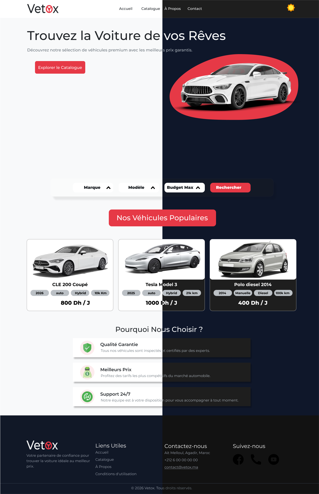

<div align="center">
  
  
  <h3>Vetox | Elevate Your Drive</h3>
  
  <p>A modern, premium car rental web platform based in the Souss-Massa region.</p>
</div>

---

## 📝 About the Project
**Vetox** is designed for a premium car rental agency located in Agadir / Ait Melloul. The project stands out with an elegant User Interface (UI), meticulously crafted to provide the best possible User Experience (UX) for clients looking to rent high-end vehicles.

## ✨ Key Features

* **Premium UI/UX Design:** High-fidelity mockups created on Figma prior to development, ensuring a pixel-perfect result.
* **Dark & Light Mode:** Native support with a seamless, smooth transition between themes to suit user preferences.

  <p align="center">
    
  </p>

* **Dynamic Catalog:** Vehicle display in a clean grid layout (CSS Grid) with clear daily pricing details.
* **Responsive Design:** Interface perfectly adapted to smartphones, tablets, and desktop computers following a strict Mobile-First approach.
* **Interactive Forms:** Simulation of a smooth booking system and an engaging contact page.

## 🛠️ Technologies Used
* **Design & Prototyping:** Figma
* **Frontend:** HTML5, CSS3 (Flexbox, Grid, CSS Variables)
* **Logic & Interactivity:** JavaScript (Vanilla)
* **Version Control:** Git & GitHub

## 👥 The Team
This university project was carried out collaboratively by:
* **Azmi Yassine:** Lead UI/UX Designer & Frontend Developer *(Architecture, Dark Mode, Responsive Design)*.
* **Imran Bentayebi:** Frontend Developer *(HTML Structure, Data Integration, Basic Styling)*.

## 🚀 How to Run the Project Locally
1. Clone this repository to your local machine:
   ```bash
   git clone [https://github.com/YASSINE-azmi/Vetox.git](https://github.com/YASSINE-azmi/Vetox.git)